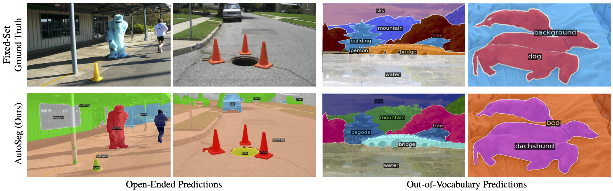
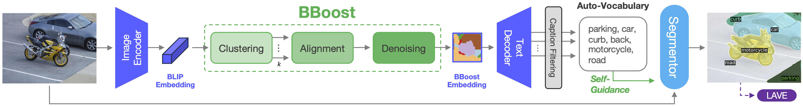

# AutoSeg: Auto-Vocabulary Semantic Segmentation
**[Atlas Lab, University of Amsterdam & TomTom](https://www.icai.ai/labs/atlas-lab)**

[Osman Ülger](ozzyou.github.io), [Maksymilian Kulicki](https://ideas-ncbr.pl/en/osoby/maksymilian-kulicki/), [Yuki Asano](https://yukimasano.github.io/), [Martin R. Oswald](https://oswaldm.github.io/)

[[`Paper`](https://arxiv.org/abs/2312.04539)] [[`Project`](https://github.com/ozzyou/autoseg.github.io)]

**Auto-Vocabulary Semantic Segmentation (AVS)** advances open-ended image understanding by eliminating the necessity to predefine object categories for segmentation (such as in Open-Vocabulary Segmentation (OVS)). Our framework, AutoSeg, autonomously identifies relevant class names using semantically enhanced BLIP embeddings, constructs a target vocabulary and segments the classes afterwards. Given that open-ended object category predictions cannot be directly compared with a fixed ground truth, we developed an LLM-based Auto-Vocabulary Evaluator (LAVE) to efficiently evaluate the automatically generated classes and their corresponding segments.

<p align="center">
  
</p>

## Get Started
```sh
# Create and activate environment
conda create --name autoseg python=3.8
source activate autoseg

# Download and install requirements
pip install torch==2.1.0 torchvision==0.16.0 torchaudio==2.1.0 --index-url https://download.pytorch.org/whl/cu118
pip install -r requirements.txt
pip install --force-reinstall --no-cache-dir git+https://github.com/MaureenZOU/detectron2-xyz.git
python -m spacy download en_core_web_sm
git clone https://github.com/ozzyou/X_Decoder.git

# Download X-Decoder weights
cd X_Decoder && mkdir weights && cd weights
wget https://huggingface.co/xdecoder/X-Decoder/resolve/main/xdecoder_focall_last.pt && cd ../.. && mkdir inputs && mkdir outputs
```

Furthermore, in ```<path to envs>/autoseg/lib/python3.8/site-packages/detectron2/data/catalog.py```, please comment out ```assert oldval == val``` to allow for vocabulary resetting.


<p align="center">
  
</p>

## Running AutoSeg
To run AutoSeg on your own images, drop the images in the ```/input``` folder and run the following command:
```sh
torchrun inference.py --conf_files X_Decoder/configs/autoseg/autoseg.yml --overrides BASE_PATH <path to AutoSeg> WEIGHT True RESUME_FROM X_Decoder/weights/xdecoder_focall_last.pt
```

You will find the output images in ```/output```. To change the hyperparameters of AutoSeg, refer to the config file ```/X-Decoder/configs/autoseg/autoseg.yml```.

## Cite
If you found this work useful, please cite our work.
```
@InProceedings{Ülger_2025_ICCV,
      title={Auto-Vocabulary Semantic Segmentation}, 
      author={Osman Ülger and Maksymilian Kulicki and Yuki Asano and Martin R. Oswald},
      booktitle = {Proceedings of the IEEE/CVF International Conference on Computer Vision (ICCV)},
      month     = {October},
      year      = {2025}
}
```
